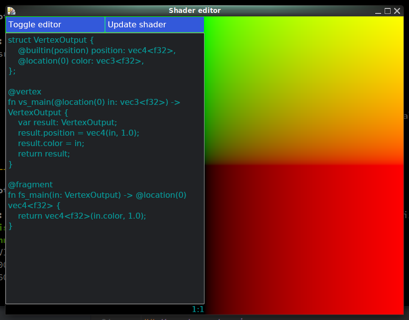

# Shader editor

A minimal WebGPU application which can run your WGSL shaders.
Built with iced, providing the ability to add some UI on top
of the rendered image.

Syntax highlight is kindly borrowed from [halo](https://github.com/bungoboingo/halo)

## Motivation

The main goal is to provide a quick way to develop shaders with
a fast iteration loop. Inspired by tools like shadertoy.

## Usage

Use `cargo run` to start

Editor:
- press `Update shader` or `Ctrl+R` to reload shader

File watcher:
- edit `shader.wgsl` file, it will be reloaded on changes

## Preview

## Roadmap

- [x] Watch shader file and do hot reload on changes
- [ ] Menu dialog to open shader files
- [x] Multiline text editor for shaders
- [x] Syntax highlight
- [ ] Show error position inside editor

## Details

The implementation is based on the following examples:
- iced [integration](https://github.com/iced-rs/iced/tree/master/examples/integration)
- wgpu [cube](https://github.com/gfx-rs/wgpu/tree/trunk/examples/cube)
  and [hello-triangle](https://github.com/gfx-rs/wgpu/tree/trunk/examples/hello-triangle).

Using [notify](https://github.com/notify-rs/notify)
for file watching.
